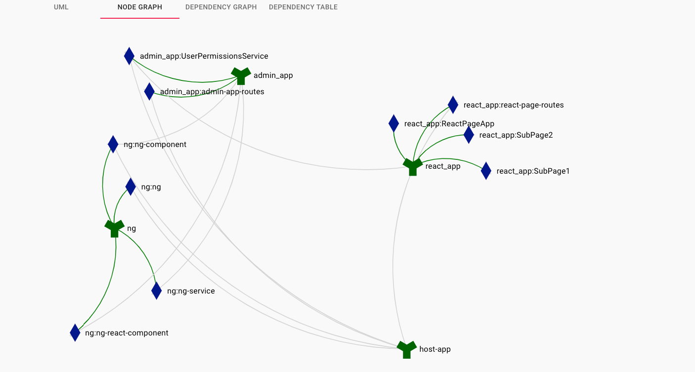

# Module federation analyzer

The aim of this sandbox is to investigate possible ways to analyze federated modules build, and what comes from where.

it uses complex-angular example as the base

it also uses module federaion dashboard docker image with respective webpack plugin:
https://hub.docker.com/r/scriptedalchemy/mf-dashboard

https://www.npmjs.com/package/@module-federation/dashboard-plugin

One of the pages of the dashboard is shown below:


## webpack-bundle-analyzer
Host app and react_app also has webpack-bundle-analyzer plugins included, so that each individual bundle
can be investigated

## Start up dashboard locally
1. pull the latest dashboard image `npm i @module-federation/dashboard-plugin`
2. start up container with following command:
```shell
docker run -p 3000:3000 \
--mount type=bind,source="$(pwd)"/analytics-data,target=/data \
-t scriptedalchemy/mf-dashboard:latest
```
3. Go to http://localhost:3000/

## Build from the scratch:
1. remove data from `analytics-data` directory
2. restart docker container
3. build the app and federated modules
4. Go to http://localhost:3000/
   